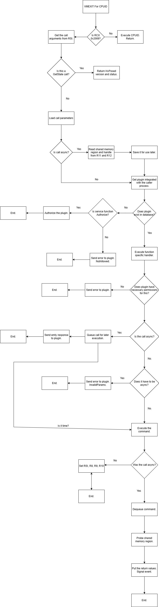

# HxPosed - Hypervisor eXposed.
A hypervisor based service provider aiming to expose depths of NT kernel to user mode. In a safe way.
Based on [barevisor](https://github.com/tandasat/barevisor)

Demo: [YouTube](https://www.youtube.com/watch?v=EzxZ9oxnZNE)

## What does HxPosed do?
HxPosed grants you hypervisor and kernel level access to your own computer. So you can do anything. That includes playing with Windows internals. Which you most likely love if you are reading this.

And yes, we mean it. There is no bullshit, no-nonsense. That is right. Here is what you get with HxPosed:
- A safe API written in Rust (available for C# and C too),
- A beautifully documented hypervisor interface,
- A no-nonsense "it just works" functionality.

## See It In Action
This is just a fraction of what HxPosed can offer to you.
### The Interface
This is the way it was supposed to be all along. Here it comes:

#### Open a process. Easy as it should be
```rust
let mut process = match HxProcess::open(id) {
    Ok(x) => x, // Good. Now we own *full* rights to the process.
    Err(e) => {
        println!("Error opening process: {:?}", e); // Gracefully explains error source, error code and reason.
        // Error source: HxPosed. Error Code: Not Found. Not Found What: Process
        return;
    }
};
```
#### Change its internals
- No offsets.
- No structure definitions.
- No NT version checks.
```rust
match process
    .set_protection(
        ProcessProtection::new()
            .with_audit(false)
            .with_protection_type(ProtectionType::None)
            .with_signer(ProtectionSigner::None),
    )
{
    Ok(_) => println!("Process protection changed!"), // Now you can kill services.exe for whatever reason.
    Err(x) => println!("Error changing process protection: {:?}", x),
}
```
#### Change privileges
- No LUIDs.
- No lookups.
```rust
let token = process.get_primary_token().unwrap();
println!("Token account name: {}", token.get_account_name().unwrap()); // Admin, User, PC whatever

let system_set = HxToken::get_system_present_privileges().unwrap(); // Gets the privilege bitmask of SYSTEM user.
token.set_enabled_privileges(system_set).unwrap(); // Overpowered now.
```
#### Allocate from nonpaged pool
- No IRPs.
- No manual memory management.
- No pointer type conversions.
```rust
let mut descriptor = HxMemory::alloc::<u64>(MemoryType::NonPagedPool);

{
    let mut guard = descriptor.map(HxProcess:current(), 0x13370000).unwrap();
    let ptr = guard.deref_mut();
    *ptr = 0x2009;

    let value = *ptr; // 0x2009
} // automatically unmapped

// automatically freed
```
### And no, its not just Rust.
It works for C, too.
- All in one header file.
- NT-style naming to feel right at home.
```c
HXR_OPEN_PROCESS open = {
    .Id = 6892,
    .OpenType = HxOpenHandle,
};

PHX_REQUEST_RESPONSE raw = HxpRawFromRequest(HxSvcOpenProcess, &open);

if (HxpTrap(raw) == -1) {
    printf("hv not loaded");
    return 1;
}

HXS_OPEN_OBJECT_RESPONSE process;
HX_ERROR error = HxpResponseFromRaw(raw, &process);
if (HxIsError(&error)) {
    printf("fail");
}

TerminateProcess(process.Address, 0); // op access rights
```

Hope you got our point. We are trying to make things easier, not harder.
From now on, you'll never worry about:
- Memory ownership,
- Undocumented NT functions,
- `STATUS_INVALID_PARAMETER`s,
- Digging out offsets and byte patterns.

It *just works*. Because we know how frustrating it is when it *just doesn't*.

Easy. Powerful. No-nonsense.

> [!IMPORTANT]
> Bindings for C# and C are on the way!

## Technical Details
Here is a diagram of how a guest (the plugin) makes a call.


And here is a diagram how HxPosed processes it.


Refer to [wiki](https://github.com/staarblitz/hxposed/wiki)

## Repo structure
`src` contains the code written in Rust.
- `hvcore` the hypervisor core.
- `hxloader` a "bootkit" that patches the Windows boot process so you can load HxPosed.
- `hxposed_core` core API providing access to hypervisor.
- `uefi` UEFI driver. Unusued.
- `windows` Windows driver of hxposed.

`HxPosed.GUI` contains the code written in C#.
- `HxPosed.Core` wrapper over libhxposed providing C# layer access to hypervisor.
- `libhxposed` native library providing access to hypervisor. Written in C and asm.
- `HxPosed.Plugins` plugin managing code.
- `HxPosed.GUI` GUI manager for HxPosed. Written in WPF.

## Get me to the point
### How to use?
Visit the [wiki page](https://github.com/staarblitz/hxposed/wiki/Setup).

### How to contribute?
There is 2 ways to help me:
1. Give feature requests and test the stuff.
2. Code them yourself.

Of course, coding them yourself would be nicer. But if you are just an everyday guy who enjoys hxposed, the first option will work well too.

Build instructions are given in the wiki.

## What we have so far?
- [x] GetState service.
- [x] Authorization service.
- [x] Async message sending receiving (works with your favourite runtime).
- [x] Plugin permission management.
- [x] Cool fluent UI that fits Windows 11 design.
- [x] Support for AMD and Intel.
- [x] Libraries in different languages (C#, C and Rust) to interact with hypervisor.
- [x] HxGuard to prevent abuse.
- [x] Automated installer for ease.

## What are you waiting for?

## Contact
[Telegram](https://t.me/staarblitz)
